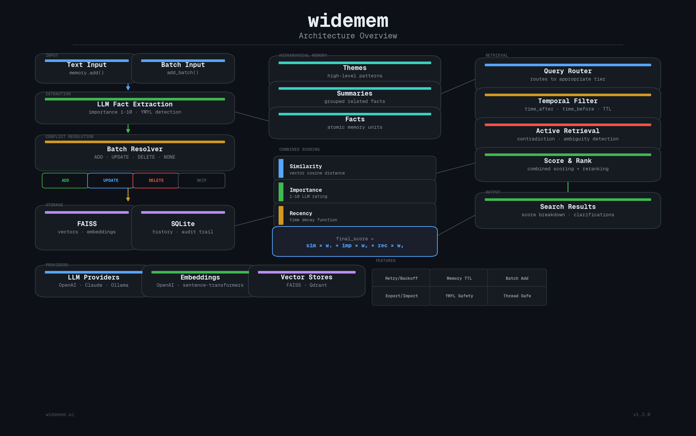
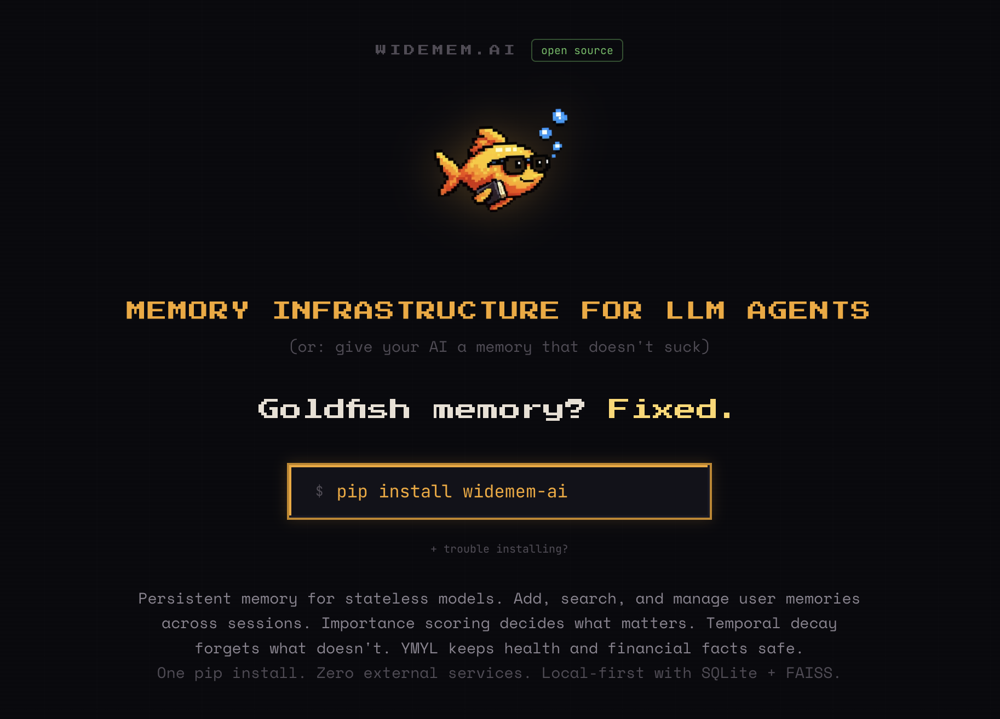

# widemem.ai

```
        .__    .___                                        .__
__  _  _|__| __| _/____   _____   ____   _____      _____  |__|
\ \/ \/ /  |/ __ |/ __ \ /     \_/ __ \ /     \     \__  \ |  |
 \     /|  / /_/ \  ___/|  Y Y  \  ___/|  Y Y  \     / __ \|  |
  \/\_/ |__\____ |\___  >__|_|  /\___  >__|_|  / /\ (____  /__|
                \/    \/      \/     \/      \/  \/      \/
```

> *Goldfish memory? ¬_¬ Fixed.*

[](https://pypi.org/project/widemem-ai/)
[](https://pypi.org/project/widemem-ai/)
[](https://github.com/remete618/widemem-ai/actions/workflows/ci.yml)
[](LICENSE)
[](https://python.org)

> **NEW in v1.4** — Confidence scoring, uncertainty modes (strict/helpful/creative), `mem.pin()` for persistent memories, frustration detection, and retrieval modes (fast/balanced/deep). Your AI now knows when it doesn't know. [See what's new ↓](#uncertainty--confidence)

### Because your AI deserves better than amnesia. ¬_¬

An open-source AI memory layer that actually remembers what matters. Local-first, batteries-included, and opinionated about not forgetting your user's blood type.

Look, AI memory has come a long way. Context windows are bigger, RAG pipelines are everywhere, and most frameworks have some form of "remember this for later." It's not terrible anymore. But it's not great either. Most memory systems treat every fact the same — your user's blood type sits next to what they had for lunch, decaying at the same rate, with the same priority. Contradictions pile up silently. There's no sense of "this matters more than that." And when you need to remember something from three months ago that actually matters? Good luck.

widemem is for when "good enough" isn't good enough.

widemem gives your AI a real memory — one that scores what matters, forgets what doesn't, and absolutely refuses to lose track of someone's prescritpion medication just because 72 hours passed and the decay function got bored. Think of it as long-term memory for LLMs, except it actually works and doesn't require a PhD to set up.

- **Memories that know their place** — Importance scoring (1-10) + time decay means "has a peanut allergy" always outranks "had pizza on Tuesday". As it should. Not all memories are created equal, and your retrieval system should know the difference between a life-threatening allergy and a lunch preference.
- **One brain, three layers** — Facts roll up into summaries, summaries into themes. Ask "where does Alice live" and get the fact. Ask "tell me about Alice" and get the big picture. Your AI can zoom in and zoom out without breaking a sweat or making a second API call.
- **YMYL or GTFO** — Health, legal, and financial facts get VIP treatment: higher importance floors, immunity from decay, and forced contradiction detectoin. Because forgetting someone's medication is not a "minor regression". It's a lawsuit waiting to happen. ¬_¬
- **Conflict resolution that isn't stupid** — Add "I live in Boston" after "I live in San Francisco" and the system doesn't just blindly append both. It detects the contradiction, resolves it in a single LLM call, and updates the memory. Like a reasonable adult would.
- **Honest about what it doesn't know** — Most memory systems hallucinate when they have nothing useful. widemem checks its own confidence before answering. HIGH? Answer normally. LOW? "I'm not sure about this." NONE? "I genuinely don't have that." You can even set it to creative mode: "I can guess if you want, but fair warning." Because an AI that admits ignorance is more useful than one that lies with a straight face. ¬_¬
- **Local by default, cloud if you want** — SQLite + FAISS out of the box. No accounts, no API keys for storage, no "please sign up for our enterprise plan to store more than 100 memories". Plug in Qdrant or any cloud provider when you're ready. Or don't. We won't guilt-trip you.

---

## Architecture

<p align="center">
  
</p>

---

## TL;DR

Six features, one library. Here's what widemem does that most memory systems don't:

| # | Feature | What it does | Why it matters |
|---|---|---|---|
| 1 | **Batch conflict resolution** | Single LLM call for all facts vs. existing memories | N facts = 1 API call, not N. Your wallet will thank you. |
| 2 | **Importance + decay** | Facts rated 1-10, with exponential/linear/step decay | Old trivia fades. Critical facts don't. |
| 3 | **Hierarchical memory** | Facts -> summaries -> themes, auto-routed | Broad questions get themes, specfic ones get facts. |
| 4 | **Active retrieval** | Contradiction detection + clarifying questions | "Wait, you said you live in San Francisco AND Boston?" |
| 5 | **Self-supervised extraction** | Collect training data, distill to a small model | LLM extraction quality, local model costs. Eventually. |
| 6 | **YMYL prioritization** | Health/legal/financial facts are untouchable | Some things you just don't forget. |
| 7 | **Uncertainty & confidence** | Knows when it doesn't know, offers to guess or asks for help | No more hallucinated answers from empty memory. |
| 8 | **Retrieval modes** | fast / balanced / deep — choose your accuracy-cost tradeoff | Same system, three price points. You pick. |

140 tests. Zero external services required. SQLite + FAISS by default. Plug in OpenAI, Anthropic, Ollama, Qdrant, or sentence-transformers as needed.

---

## Table of Contents

- [Install](#install)
- [Quick Start](#quick-start)
- [Configuration](#configuration)
- [Scoring & Decay](#scoring--decay)
- [LLM Providers](#llm-providers)
- [Embedding Providers](#embedding-providers)
- [Vector Store Providers](#vector-store-providers)
- [YMYL (Your Money or Your Life)](#ymyl-your-money-or-your-life)
- [Topic Weights](#topic-weights)
- [Hierarchical Memory](#hierarchical-memory)
- [Active Retrieval](#active-retrieval)
- [Temporal Search](#temporal-search)
- [Self-Supervised Extraction](#self-supervised-extraction)
- [Uncertainty & Confidence](#uncertainty--confidence)
- [Retrieval Modes](#retrieval-modes)
- [History & Audit Trail](#history--audit-trail)
- [Batch Conflict Resolution](#batch-conflict-resolution)
- [API Reference](#api-reference)
- [Development](#development)
- [Terms & Conditions](#terms--conditions)
- [Contact](#contact)
- [License](#license)

---

## Install

```bash
pip install widemem-ai
```

### Trouble installing?

**1. `pip` not found?** Use `pip3`:
```bash
pip3 install widemem-ai
```

**2. pip too old?** Upgrade it first:
```bash
python3 -m pip install --upgrade pip
```

**3. Python 3.9 or older?** widemem requires Python 3.10+. Install via Homebrew (macOS):
```bash
brew install python@3.10
/opt/homebrew/bin/python3.10 -m pip install widemem-ai
```

No Homebrew? Install it first:
```bash
/bin/bash -c "$(curl -fsSL https://raw.githubusercontent.com/Homebrew/install/HEAD/install.sh)"
```

**Verify installation:**
```bash
python3 -c "import widemem; print(widemem.__version__)"
```

### Optional providers

```bash
pip install widemem-ai[anthropic]             # Claude LLM provider
pip install widemem-ai[ollama]                # Local LLM via Ollama
pip install widemem-ai[sentence-transformers] # Local embeddings (no API key needed, imagine that)
pip install widemem-ai[qdrant]                # Qdrant vector store
pip install widemem-ai[all]                   # Everything. You want it all? You got it.
```

---

## Quick Start

Five lines to a working memory system. Six if you count the import.

```python
from widemem import WideMemory, MemoryConfig

memory = WideMemory()

# Add memories
result = memory.add("I live in San Francisco and work as a software engineer", user_id="alice")

# Search
results = memory.search("where does alice live", user_id="alice")
for r in results:
    print(f"{r.memory.content} (score: {r.final_score:.2f})")

# Update happens automatically — add contradicting info and the resolver handles it
memory.add("I just moved to Boston", user_id="alice")

# Delete
memory.delete(results[0].memory.id)

# History audit trail
history = memory.get_history(results[0].memory.id)
```

That's it. No 47-step setup guide. No YAML files. No existential dread. Your AI just went from goldfish to elephant in six lines.

WideMemory also works as a context manager if you're the responsible type:

```python
with WideMemory() as memory:
    memory.add("I live in San Francisco", user_id="alice")
    results = memory.search("where does alice live", user_id="alice")
# Connection closed automatically. You're welcome.
```

---

## Configuration

All settings live in `MemoryConfig`. Here's the full kitchen sink — most of these have sane defaults so you don't actualy need to touch them:

```python
from widemem import WideMemory, MemoryConfig
from widemem.core.types import (
    LLMConfig,
    EmbeddingConfig,
    VectorStoreConfig,
    ScoringConfig,
    YMYLConfig,
    TopicConfig,
    DecayFunction,
)

config = MemoryConfig(
    llm=LLMConfig(
        provider="openai",          # "openai", "anthropic", or "ollama"
        model="gpt-4o-mini",
        api_key="sk-...",           # Or set OPENAI_API_KEY env var
        temperature=0.0,
        max_tokens=2000,
    ),
    embedding=EmbeddingConfig(
        provider="openai",          # "openai" or "sentence-transformers"
        model="text-embedding-3-small",
        dimensions=1536,
    ),
    vector_store=VectorStoreConfig(
        provider="faiss",           # "faiss" or "qdrant"
        path=None,                  # Optional path for persistent storage
    ),
    scoring=ScoringConfig(
        decay_function=DecayFunction.EXPONENTIAL,
        decay_rate=0.01,            # Higher = faster decay
        similarity_weight=0.5,      # Weight for vector similarity
        importance_weight=0.3,      # Weight for importance score
        recency_weight=0.2,         # Weight for recency score
    ),
    ymyl=YMYLConfig(
        enabled=False,              # Enable YMYL prioritization
    ),
    topics=TopicConfig(
        weights={},                 # Topic boost multipliers
        custom_topics=[],           # Hints for extraction
    ),
    history_db_path="~/.widemem/history.db",
    enable_hierarchy=False,
    enable_active_retrieval=False,
    active_retrieval_threshold=0.6,
    collect_extractions=False,
    extractions_db_path="~/.widemem/extractions.db",
)

memory = WideMemory(config)
```

---

## Scoring & Decay

### The Formula

Every search result gets a combined score. It's not rocket science, but it's close enough:

```
final_score = (similarity_weight * similarity) + (importance_weight * importance) + (recency_weight * recency)
final_score *= topic_boost   # if topic weights are set
```

- `similarity` — Cosine similarity from vector search (0-1)
- `importance` — Normalized from the 1-10 rating assigned at extraction (0-1)
- `recency` — Time decay score (0-1), computed by the decay function
- `topic_boost` — Multiplier from topic weights (default 1.0)

### Decay Functions

Control how memories fade over time. Like real memories, but configurable. Unlike a goldfish, you can turn decay off entirely.

| Function | Formula | Use Case |
|---|---|---|
| `exponential` | `e^(-rate * days)` | Smooth, natural decay (default) |
| `linear` | `max(1 - rate * days, 0)` | Predictable, linear drop-off |
| `step` | 1.0 / 0.7 / 0.4 / 0.1 at 7/30/90 days | Discrete tiers |
| `none` | Always 1.0 | Elephants never forget |

```python
# Fast decay — what happened last week? who cares
ScoringConfig(decay_function=DecayFunction.EXPONENTIAL, decay_rate=0.05)

# Slow decay — memories stay relevant longer
ScoringConfig(decay_function=DecayFunction.EXPONENTIAL, decay_rate=0.005)

# No decay — all memories equaly fresh forever
ScoringConfig(decay_function=DecayFunction.NONE)
```

---

## LLM Providers

### OpenAI (default)

```python
config = MemoryConfig(
    llm=LLMConfig(provider="openai", model="gpt-4o-mini"),
)
```

### Anthropic Claude

```bash
pip install widemem-ai[anthropic]
```

```python
config = MemoryConfig(
    llm=LLMConfig(provider="anthropic", model="claude-sonnet-4-20250514"),
)
```

### Ollama (fully local)

For those of you who don't trust the cloud. We respect that.

```bash
pip install widemem-ai[ollama]
ollama pull llama3
```

```python
config = MemoryConfig(
    llm=LLMConfig(provider="ollama", model="llama3"),
    embedding=EmbeddingConfig(provider="sentence-transformers", model="all-MiniLM-L6-v2", dimensions=384),
)
```

---

## Embedding Providers

### OpenAI (default)

```python
EmbeddingConfig(provider="openai", model="text-embedding-3-small", dimensions=1536)
```

### Sentence Transformers (local)

```bash
pip install widemem-ai[sentence-transformers]
```

```python
EmbeddingConfig(provider="sentence-transformers", model="all-MiniLM-L6-v2", dimensions=384)
```

---

## Vector Store Providers

### FAISS (default, local)

```python
VectorStoreConfig(provider="faiss")
```

Zero setup. It just works. Like it should.

### Qdrant

```bash
pip install widemem-ai[qdrant]
```

```python
# Local Qdrant (file-based)
VectorStoreConfig(provider="qdrant", path="./qdrant_data")

# Remote Qdrant
VectorStoreConfig(provider="qdrant")  # Configure via QDRANT_URL env var
```

---

## YMYL (Your Money or Your Life)

Some facts are more equal than others. YMYL prioritization ensures that critical facts about health, finances, legal matters, and safety are never lost, never deprioritized, and never quietly forgotten because the decay function decided Tuesday was a good day to forget someone's insulin dosage.

> For the full deep dive on how YMYL works, edge cases, and limitations, see **[YMYL.md](YMYL.md)**.

```python
config = MemoryConfig(
    ymyl=YMYLConfig(
        enabled=True,
        categories=["health", "medical", "financial", "legal", "safety", "insurance", "tax", "pharmaceutical"],
        min_importance=8.0,          # Floor importance for strong YMYL facts
        decay_immune=True,           # Strong YMYL facts don't decay over time
        force_active_retrieval=True, # Force contradiction detection for strong YMYL facts
    ),
)
```

### Two-Tier Confidence System

Not every mention of "bank" means someone's talking about their finances. Could be a river bank. Could be a piggy bank. widemem uses a **two-tier confidence system** to avoid crying wolf:

| Confidence | How it triggers | Importance | Decay immunity | Active retrieval |
|---|---|---|---|---|
| **Strong** | Multi-word match ("bank account", "blood type") OR 2+ weak keywords | Floor at 8.0 | Yes | Forced |
| **Weak** | Single ambiguous keyword ("doctor", "bank") | Nudged to 6.0 | No | No |
| **None** | No YMYL keywords | Unchanged | No | No |

So "walked by the bank" gets a gentle 6.0 nudge. "Opened a savings account at the bank" gets the full 8.0 treatment. "Watching Doctor Who" gets a minor bump, not a medical emergency. As it should be.

### YMYL Categories

8 categories, each with strong (unambiguous) and weak (context-dependent) patterns:

| Category | Strong Patterns | Weak Patterns |
|---|---|---|
| `health` | blood pressure, diabetes diagnosis, mental health | doctor, hospital, medication, anxiety |
| `medical` | lab results, medical condition, treatment plan | clinic, vaccine, MRI, scan |
| `financial` | bank account, savings account, credit score, 401k | bank, loan, debt, salary |
| `legal` | power of attorney, child custody, court order | lawyer, contract, divorce |
| `safety` | emergency contact, blood type, epipen, DNR order | evacuation, flood |
| `insurance` | insurance policy, insurance premium | insurance, coverage, claim |
| `tax` | tax return, W-2, 1099, IRS audit | deduction, filing |
| `pharmaceutical` | side effect, drug interaction | drug, dosage, prescription |

You can enable a subset if you only care about some categories:

```python
YMYLConfig(enabled=True, categories=["health", "medical", "financial"])
```

---

## Topic Weights

Boost or suppress specific topics during retrieval. Think of it as putting your thumb on the scale, but in a socially acceptable way.

```python
config = MemoryConfig(
    topics=TopicConfig(
        weights={
            "python": 2.0,      # 2x boost for Python-related memories
            "machine learning": 1.8,
            "cooking": 0.5,     # Sorry, cooking. Not today.
        },
        custom_topics=["python", "machine learning"],  # Extraction hints
    ),
)
```

- **weights** — Applied as a multiplier to `final_score` during search. Values > 1.0 boost, < 1.0 suppress. Matching is case-insensitive substring.
- **custom_topics** — Passed to the LLM during extraction as a hint to pay extra attention to these topics. The LLM listens. Mostly.

---

## Hierarchical Memory

Three-tier memory system. Facts are great, but sometimes you need the big picture.

```python
config = MemoryConfig(enable_hierarchy=True)
memory = WideMemory(config)

# Add many facts
for msg in conversation_history:
    memory.add(msg, user_id="alice")

# Trigger summarization (groups related facts, creates summaries and themes)
memory.summarize(user_id="alice")

# Broad queries return themes, specific queries return facts
results = memory.search("tell me about alice")        # Returns themes
results = memory.search("where does alice live")      # Returns facts

# Filter by tier
from widemem.core.types import MemoryTier
results = memory.search("alice", tier=MemoryTier.SUMMARY)
```

### Tiers

| Tier | Description | Query Type |
|---|---|---|
| `fact` | Individual extracted facts | Specific questions ("what is X?") |
| `summary` | Groups of related facts summarized | Moderate scope ("alice's work") |
| `theme` | High-level themes across summaries | Broad questions ("tell me about alice") |

Query routing uses keyword heuristics (no extra LLM call) with a fallback chain — if the preferred tier has no results, it falls back to the next tier. No results left behind.

---

## Active Retrieval

Your AI shouldn't silently overwrite "lives in San Francisco" with "lives in Boston" without at least raising an eyebrow. Active retrieval detects contradictions and ambiguities, then asks clarifying questions via callbacks.

```python
config = MemoryConfig(
    enable_active_retrieval=True,
    active_retrieval_threshold=0.6,  # Similarity threshold for conflict detection
)
memory = WideMemory(config)

def handle_clarification(clarifications):
    for c in clarifications:
        print(f"Conflict: {c.question}")
        print(f"  Old: {c.existing_memory}")
        print(f"  New: {c.new_fact}")
    # Return None to abort the add, or a list of answers to proceed
    return ["User moved to Boston"]

result = memory.add(
    "I just moved to Boston",
    user_id="alice",
    on_clarification=handle_clarification,
)

if result.has_clarifications:
    print(f"Resolved {len(result.clarifications)} conflicts")
```

### Callback behavior

- `on_clarification` receives a list of `Clarification` objects
- Return `None` to abort the add entirely (the nuclear option)
- Return a list of strings (answers) to proceed with the add
- If no callback is provided, the add proceeds and clarifications are returned in `AddResult.clarifications` for you to deal with later. Or never. We won't judge.

---

## Temporal Search

Filter and rank memories by time. Because sometimes you only care about what happend recently.

```python
from datetime import datetime, timedelta

now = datetime.utcnow()

# Only memories from the last week
results = memory.search(
    "what happened recently",
    user_id="alice",
    time_after=now - timedelta(days=7),
)

# Only memories before January 2026
results = memory.search(
    "old preferences",
    user_id="alice",
    time_before=datetime(2026, 1, 1),
)

# Combined range
results = memory.search(
    "december events",
    user_id="alice",
    time_after=datetime(2025, 12, 1),
    time_before=datetime(2025, 12, 31),
)
```

---

## Self-Supervised Extraction

LLM extraction is great but expensive. widemem can collect extraction training data and optionally use a small local model for cost-efficient extraction. Think of it as teaching a smaller, cheaper brain to do the expensive brain's job.

```python
# Enable data collection
config = MemoryConfig(
    collect_extractions=True,
    extractions_db_path="~/.widemem/extractions.db",
)
memory = WideMemory(config)

# Use the memory normally — all LLM extractions are logged as training pairs
memory.add("I live in San Francisco", user_id="alice")
```

### Training a small model

```bash
python scripts/train_extractor.py export --db ~/.widemem/extractions.db --output training_data.json
python scripts/train_extractor.py train --data training_data.json --model distilbert-base-uncased --output ./my_extractor
```

The self-supervised extractor uses a fallback chain: try the small model first, fall back to the LLM if confidence is low. Best of both worlds.

---

## Uncertainty & Confidence

Most memory systems either answer or don't. They'll happily hallucinate from irrelevant memories rather than admit they don't know. widemem is honest about what it knows and what it doesn't.

Every search returns a confidence level:

```python
response = mem.search("What's Alice's favorite movie?", user_id="alice")

response.confidence     # RetrievalConfidence.NONE — nothing relevant found
response.has_relevant   # False

# But it still works like a list (backward compatible):
for r in response:
    print(r.memory.content)
```

### Three uncertainty modes

```python
# Strict: refuses to answer if unsure
mem = WideMemory(config=MemoryConfig(uncertainty_mode="strict"))

# Helpful (default): "I don't have that, but here's what I do know..."
mem = WideMemory(config=MemoryConfig(uncertainty_mode="helpful"))

# Creative: "I can guess if you want — fair warning, it might be wrong"
mem = WideMemory(config=MemoryConfig(uncertainty_mode="creative"))
```

### Pin important memories

When a user explicitly tells you something important, pin it so it sticks:

```python
# Normal add — importance decided by LLM (might be 3-6)
mem.add("I had pasta for lunch", user_id="alice")

# Pin — stored with importance 9, resistant to decay
mem.pin("My blood type is O negative", user_id="alice")
```

### Frustration recovery

When users say "I told you this!", widemem detects the frustration, extracts the fact, and offers to pin it:

```python
from widemem.retrieval.uncertainty import build_frustration_response

response = build_frustration_response(
    "I told you my blood type is O negative!",
    confidence=RetrievalConfidence.NONE,
    mode=UncertaintyMode.HELPFUL,
)
# response = {
#     "action": "recover_and_pin",
#     "message": "Sorry about that. I'm saving this now with high importance.",
#     "pin_fact": "my blood type is O negative",
#     "pin_importance": 9.0,
# }
```

---

## Retrieval Modes

Not every query needs the same depth. A casual chatbot doesn't need 50 retrieved memories. A medical assistant does. widemem lets you choose:

```python
from widemem import WideMemory, MemoryConfig, RetrievalMode

# Set at config level (default for all queries)
mem = WideMemory(config=MemoryConfig(retrieval_mode="balanced"))

# Override per query when needed
results = mem.search("critical question", mode=RetrievalMode.DEEP)
```

| Mode | Memories retrieved | ~Tokens | Best for |
|------|-------------------|---------|----------|
| `fast` | 10 | ~150 | Chatbots, casual assistants |
| `balanced` (default) | 25 | ~500 | Most production apps |
| `deep` | 50 | ~1,500 | Healthcare, legal, enterprise |

Each mode also adjusts the internal candidate pool size and similarity boost strength. `balanced` is the sweet spot for most use cases — enough context for good answers without burning tokens.

---

## History & Audit Trail

Every add, update, and delete is logged to SQLite. Full audit trail. Because "who changed this and when" is a question you'll eventually ask.

```python
history = memory.get_history(memory_id)
for entry in history:
    print(f"{entry.timestamp}: {entry.action.value}")
    if entry.old_content:
        print(f"  From: {entry.old_content}")
    if entry.new_content:
        print(f"  To: {entry.new_content}")
```

---

## Batch Conflict Resolution

When new facts are added, widemem finds related existing memories and sends everything to the LLM in a single call. The LLM decides for each fact whether to ADD (new), UPDATE (modify existing), DELETE (contradicted), or NONE (duplicate).

This is the main architectural improvement over mem0's per-fact approach. One call instead of N. The LLM sees the full context and can make better decisions. Your API bill sees fewer line items.

---

## API Reference

### WideMemory

| Method | Description |
|---|---|
| `add(text, user_id, agent_id, run_id, on_clarification)` | Extract and store memories. Returns `AddResult`. |
| `add_batch(texts, user_id, agent_id, run_id)` | Process multiple texts. Returns `List[AddResult]`. |
| `search(query, user_id, agent_id, top_k, time_after, time_before, tier, mode)` | Search memories. Returns `SearchResult` (list-compatible, with `.confidence`). |
| `pin(text, user_id, agent_id, importance=9.0)` | Store memory with elevated importance. For facts that must not be forgotten. |
| `get(memory_id)` | Get a single memory by ID. Returns `Memory` or `None`. |
| `delete(memory_id)` | Delete a memory by ID. |
| `get_history(memory_id)` | Get audit trail for a memory. Returns `List[HistoryEntry]`. |
| `summarize(user_id, agent_id, force)` | Trigger hierarchical summarization. Returns `List[Memory]`. |
| `count(user_id, agent_id, tier)` | Count memories with optional filters. Returns `int`. |
| `export_json(user_id, agent_id)` | Export memories as JSON string. |
| `import_json(data)` | Import memories from JSON string. Returns count imported. |

### AddResult

| Field | Type | Description |
|---|---|---|
| `memories` | `List[Memory]` | Newly created/updated memories |
| `clarifications` | `List[Clarification]` | Any detected conflicts |
| `has_clarifications` | `bool` | Whether conflicts were detected |

### MemorySearchResult

| Field | Type | Description |
|---|---|---|
| `memory` | `Memory` | The memory object |
| `similarity_score` | `float` | Vector similarity (0-1) |
| `temporal_score` | `float` | Recency score after decay (0-1) |
| `importance_score` | `float` | Normalized importance (0-1) |
| `final_score` | `float` | Combined weighted score |

---

## Claude Code Skill

Try widemem directly in Claude Code with the official memory skill.

### Install

```bash
pip install widemem-ai[mcp,sentence-transformers]
```

### Available commands

| Command | Description |
|---|---|
| `/mem search <query>` | Semantic search across all memories |
| `/mem add <text>` | Store a fact (with quality gates) |
| `/mem pin <text>` | Pin critical fact with high importance |
| `/mem stats` | Memory count and health check |
| `/mem prune` | Find duplicates and stale entries |
| `/mem export` | Export all memories as JSON |
| `/mem reflect` | Full memory audit — duplicates, contradictions, staleness |

### Skill repo

Full setup instructions and source: [widemem-skill](https://github.com/remete618/widemem-skill)

---

## MCP Server (Model Context Protocol)

widemem ships with an MCP server so you can plug it directly into Claude Desktop, Cursor, or any MCP-compatible client. Memory as a tool — add, search, delete, and count memories without writing a single line of glue code.

```bash
pip install widemem-ai[mcp]
```

### Run it

```bash
python -m widemem.mcp_server
```

This starts a stdio-based MCP server. Configure it in your MCP client (e.g. Claude Desktop `claude_desktop_config.json`):

```json
{
  "mcpServers": {
    "widemem": {
      "command": "python",
      "args": ["-m", "widemem.mcp_server"],
      "env": {
        "WIDEMEM_LLM_PROVIDER": "ollama",
        "WIDEMEM_LLM_MODEL": "llama3.2",
        "WIDEMEM_EMBEDDING_PROVIDER": "sentence-transformers"
      }
    }
  }
}
```

### Available tools

| Tool | Description |
|---|---|
| `widemem_add` | Add memories (extracts facts, resolves conflicts) |
| `widemem_search` | Semantic search over memories |
| `widemem_delete` | Delete a memory by ID |
| `widemem_count` | Count stored memories |
| `widemem_health` | Health check |

### Environment variables

| Variable | Default | Description |
|---|---|---|
| `WIDEMEM_DATA_PATH` | `~/.widemem/data` | Storage directory |
| `WIDEMEM_LLM_PROVIDER` | `ollama` | LLM provider (`openai`, `anthropic`, `ollama`) |
| `WIDEMEM_LLM_MODEL` | `llama3.2` | LLM model name |
| `WIDEMEM_LLM_BASE_URL` | `http://localhost:11434` | LLM API base URL |
| `WIDEMEM_EMBEDDING_PROVIDER` | `sentence-transformers` | Embedding provider |

---

## Development

```bash
git clone https://github.com/remete618/widemem-ai
cd widemem
pip install -e ".[dev]"
pytest
```

140 tests. They all pass. We checked. Even a goldfish could run them. Well, maybe not.

---

## Terms & Conditions

By using widemem, you agree to the following completely reasonable terms:

1. **No warranty.** This software is provided "as is". If your AI forgets something important, that's between you and your AI. We tried our best with YMYL but we're not lawyers, doctors, or financial advisors — and neither is your vector database.

2. **Use responsibly.** widemem stores user data locally by default. If you point it at a cloud provider, that's your responsibility. We don't collect, transmit, or even look at your data. We have better things to do.

3. **YMYL is a best-effort safety net**, not a medical device. It uses keyword matching to flag health/legal/financial content. It will catch "diabetes diagnosis" but it won't catch subtle medical references buried in metaphors. Don't rely on it for life-critical decisions. Use it as one layer of many.

4. **LLM providers have their own terms.** If you use OpenAI, Anthropic, or any other provider through widemem, their terms of service apply to those API calls. Read them. Or don't. But they exist.

5. **Apache 2.0.** You can use this commercially, modify it, distribute it, and even pretend you wrote it (though we'd appreciate a star on GitHub instead).

---

## Contact

**Radu Cioplea**
- Email: radu@cioplea.com
- Project: [widemem.ai](https://widemem.ai)
- Repository: [github.com/remete618/widemem-ai](https://github.com/remete618/widemem-ai)

Bug reports, feature requests, and unsolicited opinions are all welcome at the GitHub issues page.

---

## License

Apache 2.0 — See [LICENSE](LICENSE) for the full text that nobody reads.

---

<p align="center">
  <a href="https://widemem.ai">
    
  </a>
  <br />
  <a href="https://widemem.ai">widemem.ai</a>
</p>
